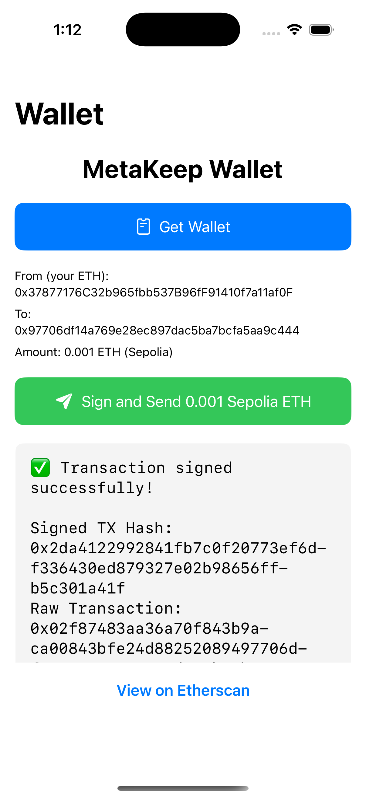

# MetaKeep iOS SDK Integration

A SwiftUI iOS app demonstrating MetaKeep SDK integration for wallet management and transaction signing on Ethereum (Sepolia testnet).



## Features

- **Get Wallet**: Retrieve user's Ethereum wallet address using MetaKeep SDK
- **Sign Transaction**: Sign Ethereum transactions using MetaKeep's secure signing
- **Broadcast Transaction**: Send signed transactions to Sepolia testnet
- **Web3 Integration**: Uses Web3.swift for transaction preparation and RPC communication

## Prerequisites

- iOS 14.0+ / Xcode 14.0+ / Swift 5.0+
- MetaKeep Developer Account ([console.metakeep.xyz](https://console.metakeep.xyz))
- Alchemy or Infura account for RPC endpoints

## Installation

### 1. Add MetaKeep SDK

Add the MetaKeep Swift Package to your Xcode project:

1. In Xcode, go to `File > Add Package Dependencies`
2. Enter the MetaKeep repository URL
3. Select version `2.0.3` and click `Add Package`

### 2. Add Web3.swift

Add the Web3.swift library for Ethereum transaction handling:

1. In Xcode, go to `File > Add Package Dependencies`
2. Enter: `https://github.com/chainnodesorg/Web3.swift.git`
3. Select the following products:
   - `Web3`
   - `Web3PromiseKit`
   - `Web3ContractABI`

### 3. Configure URL Scheme

Configure your app to handle MetaKeep callback URLs:

1. Select your app target in Xcode
2. Go to `Info` tab
3. In `URL Types` section, click `+` to add a new URL
4. Set:
   - **Identifier**: `metakeep`
   - **URL Schemes**: `$(PRODUCT_BUNDLE_IDENTIFIER)`

## Configuration

### 1. Set Your MetaKeep App ID

**Location**: `IOS-EVM-App/IOS_EVM_AppApp.swift`  
**Line**: 22

```swift
let sdk = MetaKeep(appId: "YOUR_APP_ID_HERE", appContext: AppContext())
```

**How to get your App ID**:
1. Go to [console.metakeep.xyz](https://console.metakeep.xyz)
2. Sign in to your developer account
3. Create a new app or select existing app
4. Copy the App ID from your app settings

### 2. Configure RPC Endpoint

**Location**: `IOS-EVM-App/ContentView.swift`  
**Line**: 35

```swift
private let sepoliaRPCs: [URL] = [
    URL(string: "YOUR_SEPOLIA_RPC_URL_HERE")!
]
```

**How to get your RPC URL**:
1. Sign up at [Alchemy](https://www.alchemy.com/) or [Infura](https://infura.io/)
2. Create a new project
3. Select Sepolia testnet
4. Copy the HTTP endpoint URL

Example Alchemy URL format:
```
https://eth-sepolia.g.alchemy.com/v2/YOUR_API_KEY
```

## Usage

### Get Wallet

The app automatically calls `sdk.getWallet()` when the "Get Wallet" button is tapped:

```swift
sdk.getWallet(
    callback: Callback(
        onSuccess: { (result: JsonResponse) in
            // Handle successful wallet retrieval
            let ethAddress = result.data["wallet"]["ethAddress"]
        },
        onFailure: { (error: JsonResponse) in
            // Handle errors
        }
    )
)
```

**Response Format**:
```json
{
  "status": "SUCCESS",
  "wallet": {
    "ethAddress": "0xD570518061287E79f137fca98D56902e086f95CB",
    "solAddress": "B4H5koiRxUuGz7YKALucvxUAc81k4b9Xf3aGTFXQ42mF",
    "eosAddress": "EOS8cfYwFefRy1pEeiWhvP5K5H3TV9514jyvuYeHEz1sqXbywGc2f"
  }
}
```

### Sign Transaction

The app calls `sdk.signTransaction()` when the "Sign and Send" button is tapped:

```swift
sdk.signTransaction(
    transaction: try JsonRequest(jsonString: txnString),
    reason: "Send 0.001 Sepolia ETH",
    callback: Callback(
        onSuccess: { (result: JsonResponse) in
            // Handle successful signing
            let signedTx = result.data["signedRawTransaction"]
            let txHash = result.data["transactionHash"]
        },
        onFailure: { (error: JsonResponse) in
            // Handle signing errors
        }
    )
)
```

**Transaction JSON Format** (EIP-1559):
```json
{
  "type": 2,
  "to": "0x97706df14a769e28ec897dac5ba7bcfa5aa9c444",
  "value": "0x2710",
  "nonce": "0x1",
  "data": "0x",
  "chainId": "0xaa36a7",
  "gas": "0x5208",
  "maxFeePerGas": "0x3e8",
  "maxPriorityFeePerGas": "0x3e7"
}
```

**Response Format**:
```json
{
  "status": "SUCCESS",
  "signedRawTransaction": "0x02f86c8189018203e78203e8179497706df14a769e28ec897dac5ba7bcfa5aa9c444822710850123456789c080a01a84678f385553358386051464a252fa25d019335deb20262eb231d4ec146730a00e6f1944e872430b7e04af6dd68ece90e2a9995a7abd827b50588602523b5256",
  "transactionHash": "0xe02497f6d7d4b52197a35db6115633b34802f90eaa98e894791999ca0d6b11f8",
  "signature": "0x1a84678f385553358386051464a252fa25d019335deb20262eb231d4ec1467300e6f1944e872430b7e04af6dd68ece90e2a9995a7abd827b50588602523b525600",
  "r": "0x1a84678f385553358386051464a252fa25d019335deb20262eb231d4ec146730",
  "s": "0x0e6f1944e872430b7e04af6dd68ece90e2a9995a7abd827b50588602523b5256",
  "v": "0x0"
}
```

### Broadcast Transaction

After successful signing, the app automatically broadcasts the transaction to Sepolia:

```swift
// POST to your RPC endpoint
let result = try await rpc(method: "eth_sendRawTransaction", params: [rawTransaction])
```

## Project Structure

```
IOS-EVM-App/
├── IOS_EVM_AppApp.swift          # App entry point, MetaKeep SDK initialization
├── ContentView.swift             # Main UI and MetaKeep operations
├── Assets.xcassets/             # App icons and assets
└── Info.plist                   # App configuration
```

## Dependencies

- **MetaKeep**: Mobile SDK for wallet operations
- **Web3.swift**: Ethereum transaction handling and RPC communication
- **SwiftUI**: iOS UI framework

## Testing

1. **Build and Run**: Use `⌘ + R` in Xcode
2. **Get Wallet**: Tap "Get Wallet" to retrieve your ETH address
3. **Sign Transaction**: Tap "Sign and Send" to sign a 0.001 ETH transaction
4. **View on Etherscan**: Click the Etherscan link to view your transaction

## Troubleshooting

### Common Issues

1. **"No such module 'MetaKeep'"**
   - Ensure MetaKeep package is added to your target dependencies
   - Clean build folder (`⌘ + Shift + K`) and rebuild

2. **"No such module 'Web3'"**
   - Ensure Web3.swift package is added with correct products
   - Check target dependencies include Web3, Web3PromiseKit, Web3ContractABI

3. **URL Scheme not working**
   - Verify URL Types configuration in Info.plist
   - Ensure bundle identifier matches your app

4. **RPC calls failing**
   - Check your RPC URL is correct and accessible
   - Verify your API key has sufficient quota

### Debug Information

- Check Xcode console for detailed logs
- MetaKeep operations log success/failure responses
- RPC calls log endpoint attempts and responses

## Support

- **MetaKeep Documentation**: [docs.metakeep.xyz](https://docs.metakeep.xyz)
- **Web3.swift**: [github.com/chainnodesorg/Web3.swift](https://github.com/chainnodesorg/Web3.swift)
- **MetaKeep Console**: [console.metakeep.xyz](https://console.metakeep.xyz)

## License

This project is provided as an example implementation. Please refer to individual dependency licenses for usage terms.
